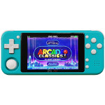

# Z-Pocket Game Pro(ZPG Pro)

  
|Component|Description                                                                                    |
|---------|-----------------------------------------------------------------------------------------------|
|CPU      |RK3326 Quad Core 1.5GHz                                                                        |
|RAM      |1GB                                                                                            |
|Screen   |3.5" 320x480                                                                                   |
|Slot     |MicroSD、Jack、Mini HDMI                                                                       |
|Gamepad  |DPad、4 Buttons、Start、Select、L1、R1、L2、R2、Power、Volume+、Volume-、Mode1、Mode2、Joystick|
|USB      |OTG                                                                                            |
|WLAN     |Wi-Fi 802.11 b/g                                                                               |
|Bluetooth|v4.2                                                                                           |
|Battery  |3.7V 2830mA                                                                                    |
|Dimension|155mm x 61mm x 17mm                                                                            |
|Weight   |211g                                                                                           |

### https://steward-fu.github.io/website/index.htm
